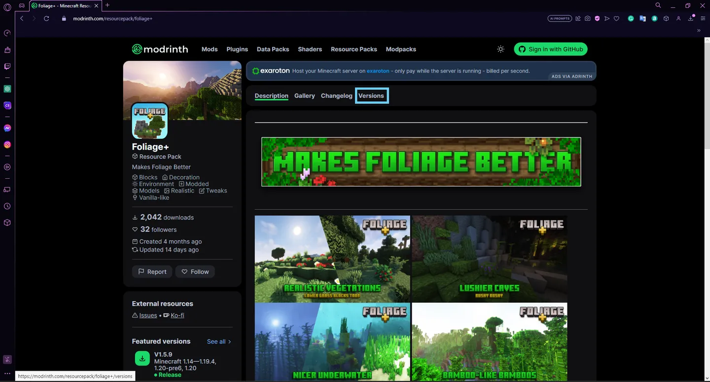
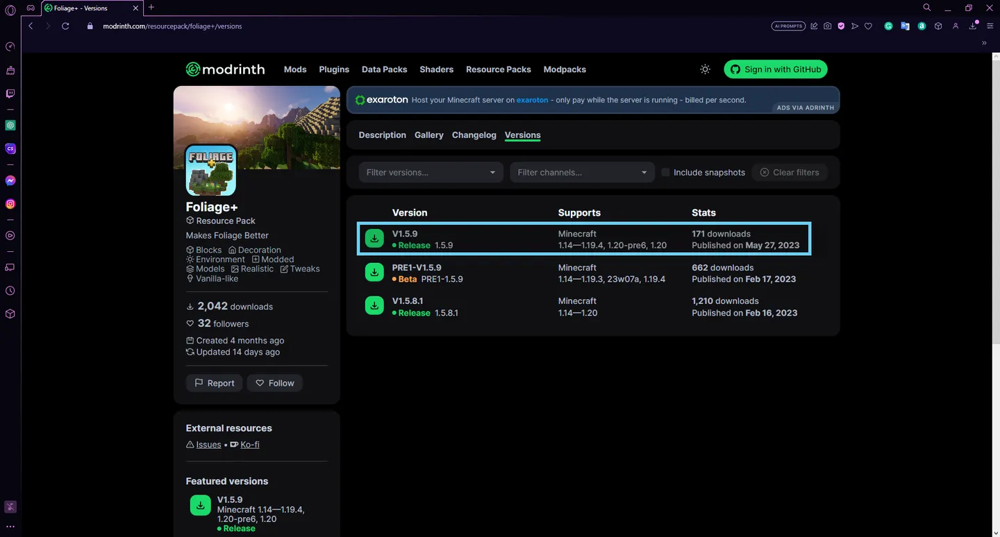
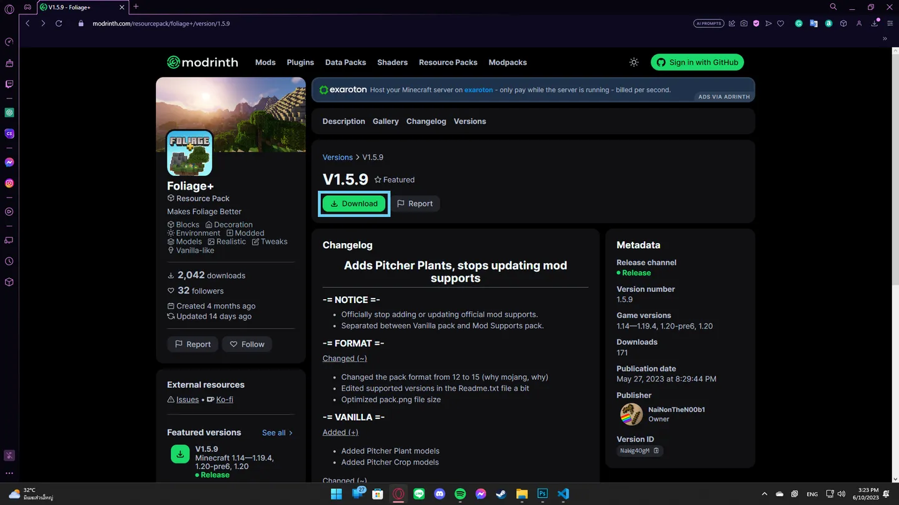
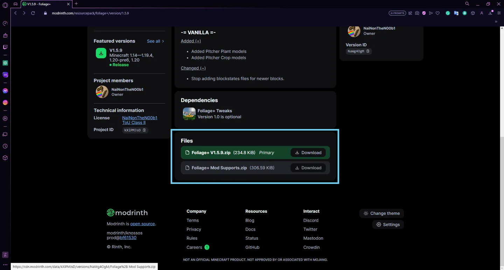
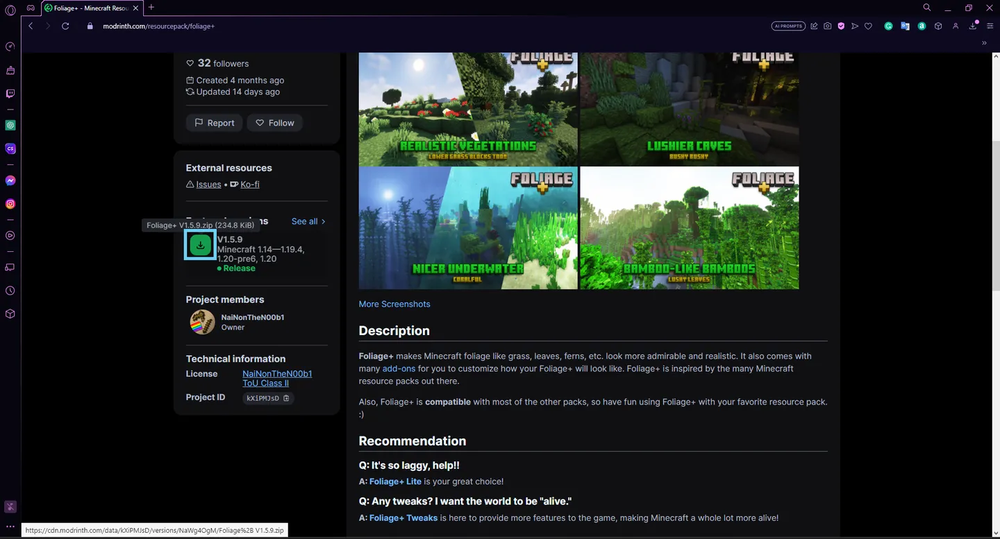
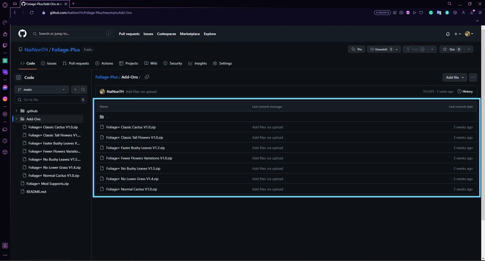
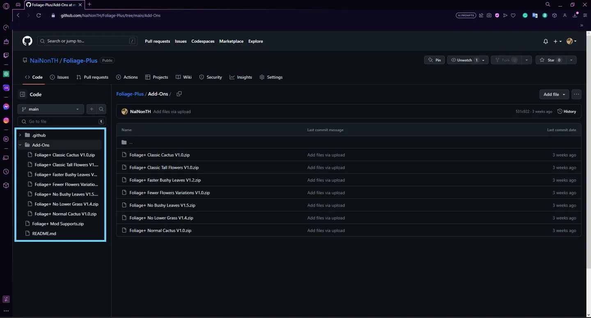
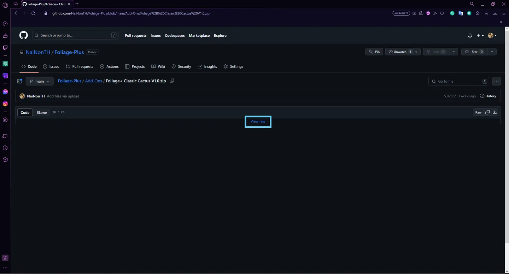
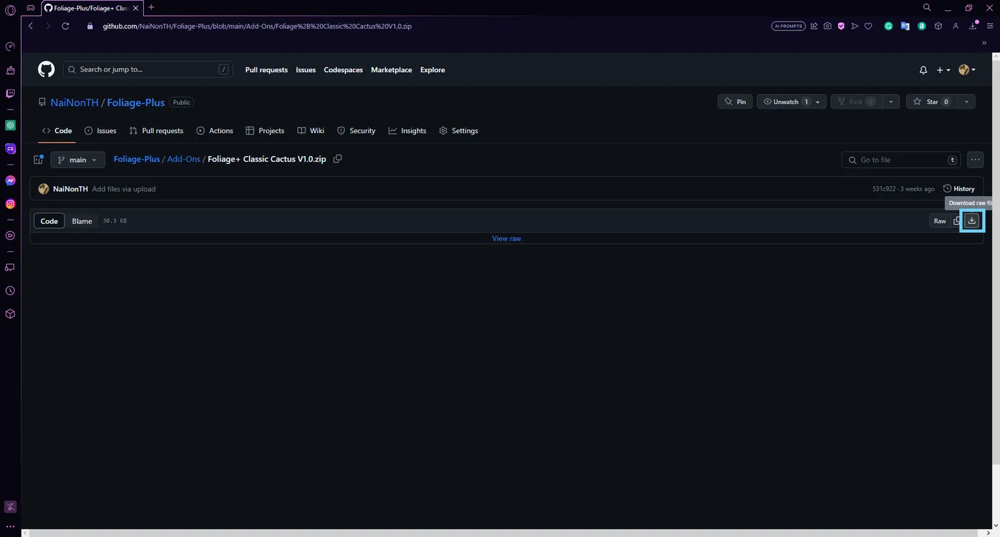

## Modrinth

To download content from Modrinth...

1\) Click the "Versions" button above the description box.

2\) Click on the latest version of the mod.

3\) Click the green "Download" button. You can download other files below as well.

With this way, you can also see other versions available, and which mod is incompatible, or embedded with.

**Or,** You can also do this way: on the mod page, find the latest version (and the correct version for your game version) of the mod next to the description box below the mod details. Then, click the green download button to the right of the version name.

Although this method is the fastest way to download, you won't be able to see the dependencies or the changelog — which may includes the developer's message — of the mod.

## GitHub

To download a file available on GitHub...

1\) Click on the name of the file you'd like to download.

**Or,** you can select a file or direct to other files on the sidebar as well.

2\) Click "View Raw"

**Or**, you can click this download button as shown in the picture instead.

