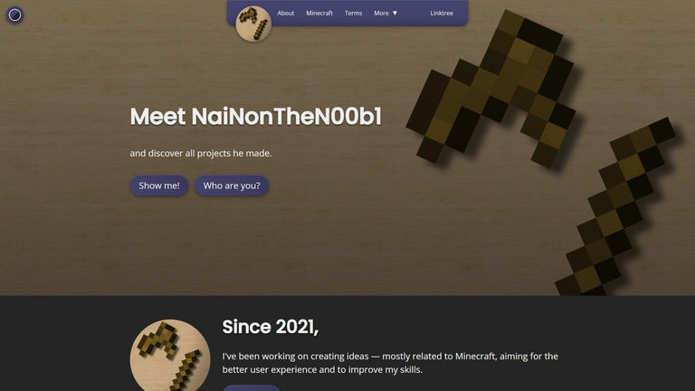
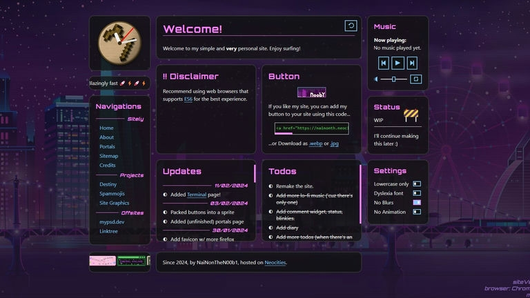

Before I made this website, I already had two old websites: my Devsite and my Neocities website. And I felt like they both were missing something. So I make a new one with a different philosophy behind it.

## The Problem of Devsite

Let's start with the problem of Devsite that I found somewhat stupid.

### It is **CRINGE**

The Devsite I made was meant to give a professional feel to the visitor; hence, I would write something that would sound... well... "professional" on the landing page. This, however, didn't start since the Devsite, but another website that I made a long time ago when I was under 18, hosted on [GitHub Pages](https://pages.github.com). Blog posts, likewise, are also written to be something technical-related.

But little did that minor me know that what he wrote at the time was "CRINGE-AF." Imagine writing all of those, pretending to be some kind of genius, just to promote Minecraft resource packs that he made, and they're messy as heck.

<aside>
Speaking of Minecraft resource packs, I don't know if I'll go back and continue doing it since I've lost interest in Minecraft since 1.20 point something. They're pretty much boring now, I would say.
</aside>

### It is Made With an Overkill <abbr title="JavaScript">JS</abbr> Framework 

I used [SvelteKit](https://kit.svelte.dev) to make the Devsite because I thought that I needed some kind of <abbr title="Server-Side Rendering">SSR</abbr> to generate pages from data files. Since it still requires a compiling and bundling process, it is quite slow to build. Not to mention that it also ships unnecessary JavaScript files that could slow down the performance. It took me a couple of months to realize that all I actually need is just an <abbr title="Static Site Generator">SSG</abbr> that converts markdown and data files into static HTML pages.

SvelteKit is still a pretty good tool for creating complex web apps, and I love using it, but it is too much for a simple personal website like this.

## What About Neocities?

<aside>
I got to give Neocities a credit though for letting me know that a website doesn't need to be professional; it can also be <strong>fun and creative!</strong>
</aside>

However, though, I think that the Neocities website I made also has problems.

### Technical Difficulties with Neocities'

At the time, when I had a Neocities account, Neocities already had CORS blocked for new free accounts. This means that I can't run any HTTP request script on my Neocities website, including chatboxes, visitor counts, etc. If I want Neocities to allow CORS for me, I need to pay them $5/month, which is not the best for the buck since there are many services that are cheaper than Neocities.

Also, dragging and dropping a folder into its file manager behaved weirdly; nesting folders were not created once you dragged a folder containing them into its file manager. Instead, the content inside those folders will be created in that folder (without nesting folders).

Lately, however, I've tried doing that again, but [that issue seems to be fixed](https://github.com/neocities/neocities/issues/491).

### It Feels Not Like **Me**

All the ideas and stuff on the Neocities website are pretty much from the other websites out there like Jukebox, Website to-do list, etc. I might like them, but as time passed, I began to dislike the theme of my Neocities website. Not to mention that I'm not quite in favor of my website having an old internet layout aesthetic. **Just the layout, though**, because I still love that I can express anything on my website.

## My Tools For New Website

I'm looking for a website between my Devsite and Neocities website while focusing on content like the blog and updates. Meanwhile, the tool I'll use also needs to be fast and capable of parsing content and data files quickly.

From the requirements above, I need an SSG. There are many SSGs that I can choose to work with. However, I'm going with [11ty](https://11ty.dev). This is because 11ty is written in JavaScript, which I'm familiar with, combined with the massive package ecosystem of JavaScript, they make 11ty more flexible, compared to the other SSGs. I also use [Bun](https://bun.sh) for a runtime instead of [Node](https://nodejs.org) due to its speed, which allows to build the site faster.

I'm still bringing <abbr title="Syntactically Awesome Stylesheet"><a href="https://sass-lang.com">SASS</a></abbr> into my stack, and I'm not thinking of bringing any CSS frameworks into my website. Not only does SASS add nesting and mixins into CSS, but it also can minify the CSS output without adding more dependency. For scripts, I'll manually write them only if it's needed, then use [UglifyJS](https://www.npmjs.com/package/uglify-js) to minify my JavaScript files as well.

After SSG generates HTML pages, their source code look pretty ugly and unorganized. But nobody cares about how it looks, right? So I use [HTML Minifier](https://www.npmjs.com/package/html-minifier) to make them look ugly even more. But at least it doesn't look that unorganized anymore since they're all just one long line of HTML code.

With libraries and SSG I've mentioned combined, I can make my fast and lightweight personal website, which takes less than a second to build compared to around 7 seconds on SvelteKit, while having a good <abbr title="Developer Experience">DevX</abbr>.

## This First Post

The blog post you're reading right now should be the first blog post of this website (so Hello, world). I don't know what I will write for a blog post on this website, but I'm leaving that to my future thoughts and decisions.

Is this website going to be remade again? No idea.