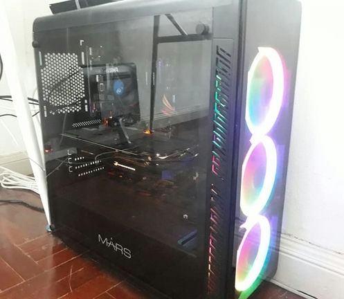
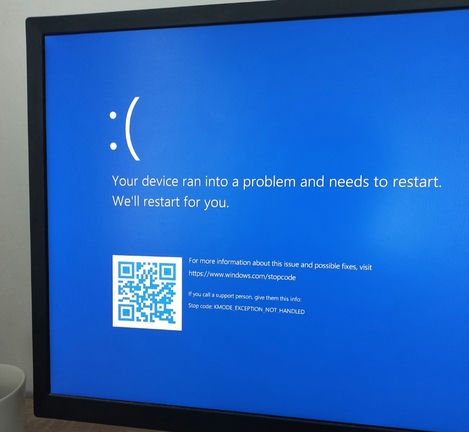
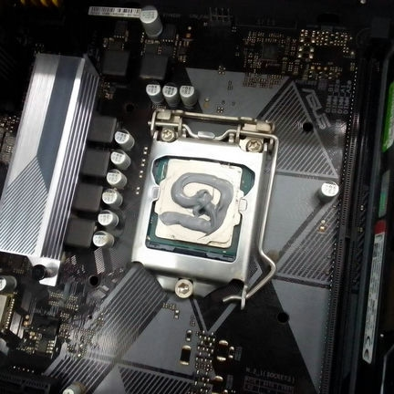

I've been using my PC since 2019, and we've been through a lot of things together. Until one day, it couldn't turn on — the monitor was blank, and my keyboard and mouse didn't function. I tried to restart but nothing came up.

I got to say that, actually, this is not the first sign. My PC already had some "CPU Fan Error" issue where my PC is booted up with the said warning. However, restarting fixed it.

Maybe this time, it was actually some serious issue.

## "Work," But Not

I still had no idea what was the actual cause of the problem that my PC was facing, so I decided to turn the power supply off and wait until it's morning.

It was a late morning and I tried turning my PC back on again, but now, it actually turned on. However, it did a POSTed in safe mode. Maybe it was because of my attempt to restart the PC when it was trying to turn itself on. So I restarted the PC and it booted into the Windows UEFI settings because it didn't boot correctly. I explored it for a while, **until...**

Nevertheless, it restarted and booted up like normal. I thought it was over, **but no, it wasn't.**

I then kept using my PC. Until it was around early afternoon, my PC suddenly froze upon me. And when I tried restarting it, it went blank again. So I asked my father to bring my PC to a repair shop.

## The Cause

Meanwhile, me and my parents were figuring out what was the actual cause of this; maybe it was the drive that was being edged to much, or could it be the mainboard failure? But to make sure, bringing it to a repair shop is an ideal.

Once it was in the repair shop, my father called me and he said that a technician had tried booting up my PC, and yes, it had booted up like normal — same as what I found. But I also told my father that it would froze and not be able to turn back on after using it for a while. The technician, then, took off the CPU cooler, and jackpot.

The thermal paste applied to the CPU was dried out, causing the CPU to constantly overheat and shut itself down. Thus, they applied the new thermal paste to my poor CPU, and that should be good to go. Previously, I also requested my father to buy a new SSD for me, which was 512GB. Additionally, my father requested the technician to change the CMOS battery as well.

And that's why I was gone for quite a while. Still, I hope my story helps fix your issue, more or less.
