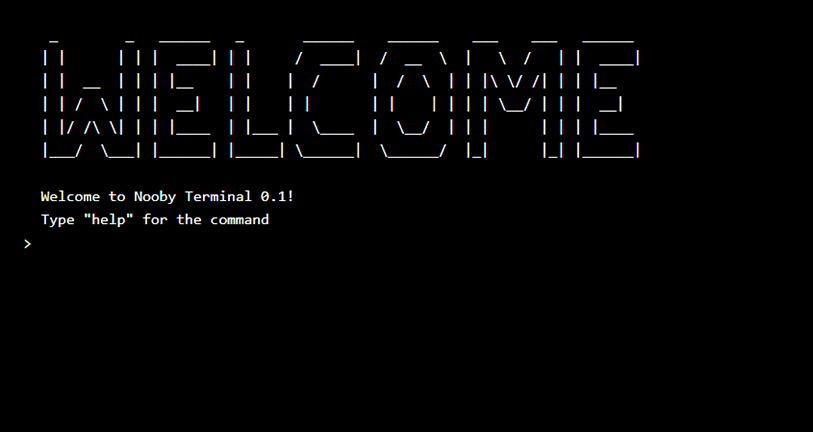
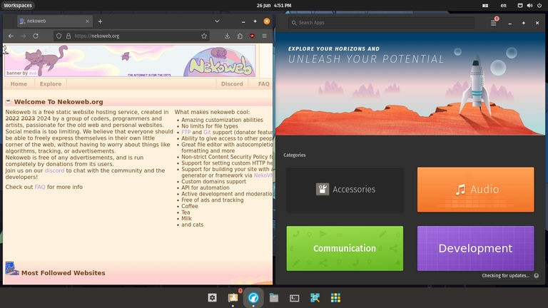
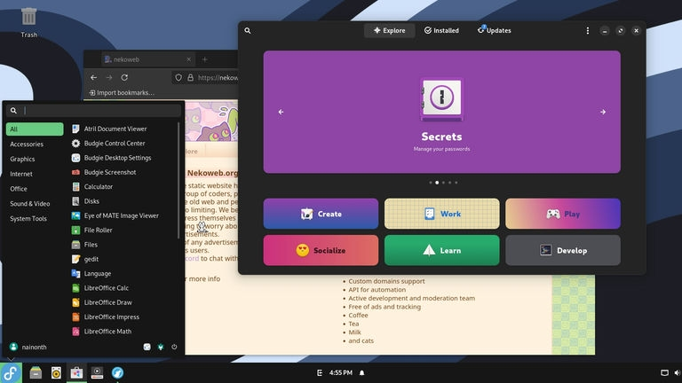
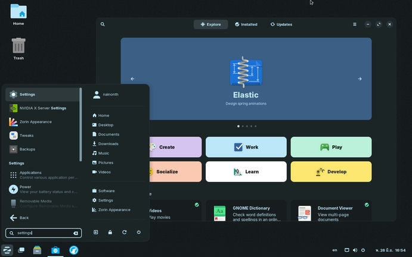

It's been almost a month since the recent blog post was published (31/05/2024), and it's time for another one.

The title already said what this blog is going to be about, so let's get this to the point.

## A Programming Language

I learned about Brainfuck around months ago, and I've discovered a lot of its interpreter and compiler made using a lot of programming languages. That gave me an idea of creating a programming language that can perform certain calculation, control flows, and store variables, while remaining as simple as possible.

So I came up with an idea of [Sign](https://github.com/NaiNonTH/sign-lang), a programming language that performs calculation through signs and its group, with the instructor that will tell the interpreter what to do with the value. It is written in [JavaScript](https://developer.mozilla.org/en-US/docs/Glossary/JavaScript) with [Bun](https://bun.sh) as a development runtime.

You can try it out now by installing the interpreter from [npm](https://npmjs.org/sign-lang), which already has 99 downloads at the time of writing, and I don't know how.

```
#h =-        | store value 26 to "h"
*h ----      | multiply h by 4 - return 104
>  {h}       | this prints "h"
>> {h}       | this prints "104"
v  --        | jump by 2 lines
>> =-------
>  {h}-

| outputs "h104i"
```

But what's the whole purpose here? I don't know—I only made it because it's fun to do. But hey, at least I got to learn how to use test runner to test the test runner itself. <span aria-hidden="true">:3</span>

## Another Terminal

If you've visited my Neocities website before, you might have seen the [terminal](https://nainonth.neocities.org/terminal) that I made, right? Well, since I had moved to Nekoweb, I just left it there without updating it. And now, I think it's time to recreate a new and better one.



For this new terminal, I'm going to reimplement most of what my old terminal has, like how you can view, create, write, run, and remove files. However, I also plan to remove certain commands like `date`, as we can use `eval Date()` instead and `curl`, since it only works when CORS Policy allows to perform any HTTP request outside the site.

In the meantime, I'm also going to make a new `swatch` command, which display the current [Swatch Internet Time](http://www.swatchclock.com/about.php), an another cool way to view online time. I also plan to add directories too, but it's quite a pain to implement, so I'm not sure if this idea would go live in production.

The terminal is still in development and not visible to public.

## Trying Out Linux

You might have seen my Uses section in my [Webmaster](/webmaster/) page that I've been trying to degoogle myself in favor of more privacy-focused alternatives, especially on Search Engines. This, however, also includes Microsoft in the mix, as its Windows sends (and may collect) data to its server.

Moreover, Microsoft is getting a lot more skeptical day by day for its strong push of Copilot and AI things combined with the fact that it's forcing every product into users like requiring users to sign up to a Microsoft account to use Windows, banners that are being shown to users, begging them to move to Windows 11, and its choices of getting rid of other stuff that seems not make its money. Not to mention of what it has done to my beloved game like Minecraft.

I am sick of Microsoft.

Hence, Linux is my new way to go for my daily computer operating system. These three are Linux Distributions (Distros) that I've tried:

* [Pop!_OS](https://pop.system76.com)
* [Zorin](https://zorin.com/os/)
* [Fedora](https://fedoraproject.org) with [Budgie](https://buddiesofbudgie.org) Desktop Environment

As you can see, the Operating Systems I've tried here are a "just works" kind of distros, since I still want an operating system that is easy-to-use like Windows, and doesn't require me to install and manage dependencies on everything on my own.

### Pop!_OS

Pop!_OS is the first Linux Distro I've ever tried. The killing feature is its Launcher menu that allows me to switch apps easily using only keyboard—easier than <kbd>Alt</kbd>+<kbd>Tab</kbd> on Windows. It also comes with an auto Tile Windows option too. It's an operating system that sits between an existing mouse-based control and a faster keyboard control. Its Pop!_Shop also comes with a lot of apps, including [Steam](https://store.steampowered.com).



### Fedora

After that, it's Fedora. I would say that Fedora is a little bit harder distro to use compared to other distros mentioned on the list above, due to the lacking of apps in its store. Budgie Desktop Environment isn't much keyboard-friendly as other distros mentioned, but its design is pretty nice.



### Zorin

Then, it's Zorin. Zorin has a very similar layout and features to Windows, with its Application Menu that resembles the Windows 7 Start Menu, although you can customize how the layout will look and feel. The keyboard experience is not so bad too, and its Software shop also has a lot of apps like Pop's.



I still can't find the distro that I will be moving in, so I might need to keep using Windows for now.

### A Little Vent

I tried these Linux Distributions on [VirtualBox](https://virtualbox.org), and I kind of have some issue with it: The performance while using a guest operating system with it is awful; it's really laggy, and I don't know if there's a way to fix this.

## In the End...

And that's about it for stuff that I made in June 2024. The next things I'm looking for are when I will fully move to Linux, and if the terminal will be like what I wanted in production.