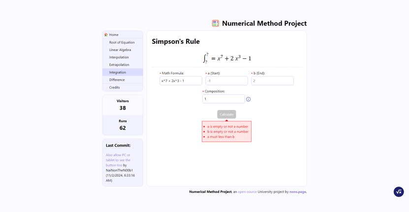

It's been about 5 months since the [previous post](https://nons.page/blog/what-i-have-been-doing-since-june/), and now, I kinda have another story that I want to tell: it's about the projects that I'd worked on for a month as university assignments: the [Numerical Method Webapp Project](#numerical-method-webapp-project) and [OOP Game Project](#oop-game-project).

This one is pretty long, so be ready.

## Numerical Method Webapp Project

This one is optional—I can choose to do it for an extra score or just ignore it—but I was very worried that the mid-term Numerical Method exam score would turn out bad. So I decided to work on it before the score was released.

Despite the score turning out to be way better than I expected when it was out, I had already joined in making this app. So, yeah I had to make it anyway.

### What I Had to Do

For this project, I was assigned to create an app that performs all calculations about Numerical Method topics available in the lecture while including some more features, such as graphs, progression tables, and solutions. Also, there was a table of each web feature that I would receive when added to my web app. However, this part would make things go kind of wrong later on.

| Entry            | Score   |
| ---------------- | ------- |
| Webapp           | 5%      |
| API Server       | 5%      |
| Database         | 5%      |
| Docker           | 5%      |
| Deploy on Server | 5%      |
| Swagger          | 5%      |
| CI/CD            | 5%      |
| `(?)`            | 5%      |
| **Overall**      | **40%** |

### How I Made It

I picked [SvelteKit](https://svelte.dev/docs/kit/introduction) for the framework since I'm pretty familiar with it. While making this though, I was pretty chill with this project, since I could just use the code implementation for those topics that I did for normal assignments.

So I slowly added each topic into the Numerical Method as I finished the code implementation, and some extra things like graphs, tables, and solutions. However, I didn't implement these features on every topic, as I found some to be pretty hard to implement. And this, as well, would affect me later on.

I also made an API for randomizing equations and connecting to the Database for visitors and run count, and I deployed it on [Netlify](https://netlify.com) without using Swagger or Docker.

### When It's Time

On the 2nd November, 2024, I needed to show my app to my lecturer. Things were going pretty good so far, *until...*

My lecturer stumbled upon the Simpson's Rule page with no graph. He then questioned me: "How will you know if the answer that you got is correct?" At that time, I already knew that I was genuinely fucked and stayed silent. So he made me delete the entire page and started writing them again while adding the graph output into the page.

The thing is, the reason why I didn't implement the graph was because it was a pain to implement, and now I had to do it. I had to write everything on the page from the ground up and add the graph. It was so hard and depressing that I felt my tears literally flow in front of the computer a little.

Four hours passed, and I made it. I rewrote the entire thing and included a really nice graph. But he then revealed that to get the score, I had to complete everything in the table above, including the Swagger, Docker, and **Unit testing (which is the (?) in the table)** that I didn't do.

So all I received was just an "Attempted" tick and a score of pure *zero*.

~~The app is at nm.nons.page~~ and [here's its source code](https://github.com/NaiNonTH/nm-project).

**Update 29/05/2025: The app has already been taken down. You won't be able to use it.**

## OOP Game Project

This one is a real assignment. Before starting, my lecturer assigned me to make a proposal for the game and wait for his approval.

### Failed Proposal

At first, I sent him a proposal of a very simple game that all you need to do is to click the white circle and avoid the red one. Also, some white circle will turn red once being hovered, and if you misclick or click on the red circle, you fail. However, he said that the game was too easy and told me to change the game idea.

### New Proposal

So I suggested another game, which I came up with its basic idea before the circle-clicking game proposal I sent to him, and extended the gameplay and the lore a little bit.

So the idea was, in the game, you would play as a truck driver driving on the road in the middle of the water, and there would be a bunch of obstacles to avoid. However, you can make your truck float, making you temporarily invincible, until the stamina bar is empty.

To put it simply, it's kinda like Subway Surfers, but truck.

And thankfully, I finally got the approval but was tasked with two more features: more maps and obstacles for each map with special functionality, and a countdown timer.

### Implementing New Features

The timer actually sparked my idea of adding Oil Barrel into the game, used to increase the truck speed and the time once collected. Although I initially wanted the speed of the truck to increase over time, because of Oil Barrel, I scrapped that idea, as I think increasing speed with Oil Barrel is much better.

For obstacles, I added the cone and the hole, including the rice and the barrier from my proposal. Each of them affects the truck differently once collides:

* The rice and the barrier both end the game once collided.
* The cone decreases the truck speed by a constant number.
* The hole slows the truck down for 1 second before setting the truck back to its base speed.

I had a little issue with adding maps since I thought that making separate maps sounded like more work and did nothing much to the game. So I decided to include all maps into a single run without map selections, and make them gradually and seamlessly change as the player progresses in the game.

### Finishing Project

Finally, I made a report for it, and the presentation went pretty well with no issues. Although there was a bug that didn't display the game before the presentation, it was a pretty easy fix (just swapped 2 lines of code), and I could still fix my game and report after the presentation.

")

Despite not knowing the final score yet, I think things went pretty okay. The [source code is here](https://github.com/NaiNonTH/drug-driver), and you can download a .jar file to play it there. Note that you need to have at least [Java 8](https://www.java.com/en/download/) installed on your computer.

## What's Next

And that's the reason why I didn't visit my website as much as before.

For what's next, I'm thinking of remaking the layout of this website, but I still can't find the one I like. Maybe I'll try experimenting with it a bit more since I'm free until the last week of this month.

By the way, the vibe of November is really nice and fits the music I'm listening to right now so well. I'm not sure if being able to pass a hard time from those two projects contributes to this but I'll take it.