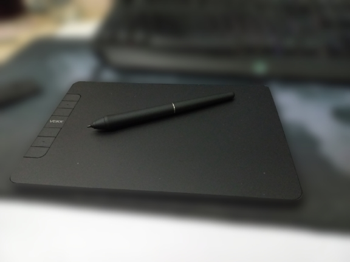

**Update 25/03/2025: I made some grammar corrections and mentioned XP-Pen Star 03 V2 since I was thinking of buying it too.**

## The Laziness

I'm a pretty lazy kind of person (and maybe we all are). But sometimes, it's kind of annoying.

I normally have my iPad for some note-taking and completing PDF assignments for university, so I usually need to put it in my bag.

However, here's a thing; when I need to use my iPad at home for some assignments, most of the time, my iPad will still be in the bag downstairs, and going outside my room and going downstairs just to get an iPad is something that a lazy guy like me isn't going to do, so I just completed assignments using my PC and a **mouse** instead.

Yep, a mouse. Although it works, writing something using it is really slow.

And that made me think of buying a graphics tablet to do assignments on my PC instead of using a mouse. If I remember correctly, I'd watched [ExplainingComputers' video about one](https://www.youtube.com/watch?v=-rvf4TdlkNs).

## Looking for a Graphics Tablet

I hadn't used a graphics tablet before and didn't even know if I would be able to handle the learning curve, so I didn't want to spend tons of money on it just yet. Also, I don't need much for a graphics tablet. I just need something that allows me to do some markup on a PDF file on my Windows PC.

I looked up on Shopee to find one that might interest me. Here are a few of them that I am interested:

### One by Wacom

This is the first one that I found. It's made by Wacom, a company well-known for making great graphics tablets. It also appeared in the ExplainingComputers' video that I mentioned too.

Despite their reputation, however, their entry-level graphics tablet, One by Wacom, appears to be the most pricey compared to my other choices, even the smallest one, and it only supports 2048 pressure levels, compared to 8192 on the others. Although I wouldn't need much pressure level, it's still not something worth the price.

### XP-Pen Deco Fun

This is the second one that I found. It's cheaper than One by Wacom, and it supports pen pressure levels up to 8192. XP-Pen's reputation seems pretty decent, and they appear to be a co-producer of osu!tablets, too. Here's a [news post about it](https://osu.ppy.sh/home/news/2025-02-12-osu-tablets-return).

However, it's still priced at over 1000 Thai Baht for an S size, and I found another cheaper one with a dimension pretty close to it.

### XP-Pen Star 03 V2

This one is pretty wild. It was priced at around 1500 Thai Baht—pretty close to the smallest One by Wacom, but cheaper—but it came with 10x6 inches in dimension, which was roughly close to the biggest size of One by Wacom. Although it's old, its specs are pretty nice to me. As I said, however, I don't need such a powerful tablet, so I continued looking.

### Veikk VK640

This is the one that I picked. It was priced at 899 Thai Baht, which is dirt cheap considering this is the price from the official store itself.

Speaking of Veikk's tablets, I found so many options that I was interested in, from Voila L, S640, and A30. However, I picked this one because I think it's pretty much a balance compared to others. It has quick access buttons—which I might use later—it looks pretty nice, and I saw it is worth the price.

After I got my graphics tablet and unboxed it, I found a lot of accessories that came with the tablet. There was a pen stand, a drawing glove, a pen case, a bunch of pen nibs, and a nib remover.

## My Experience

Once I plugged the tablet into the PC, without installing its software, it worked like a charm, and I didn't take much time to be able to use it. However, I can't really say that I'm *used* to it because my hand will get tired after using it for quite some time, because I need to hover the pen very close to the tablet in a position that I'm not used to. Also, the shortcut button on the pen can cause things to go buggy for some reason.

It's been about a month since I got a tablet now, but I don't really use it for comprehensive writing that much. However, it's still pretty useful for doing some quick drawing for problem abstraction and a little bit of markup.

## osu?

Yeah... about that.

I tried using it to play osu!, but I sucked at it so bad that I went back to mouse, lol.