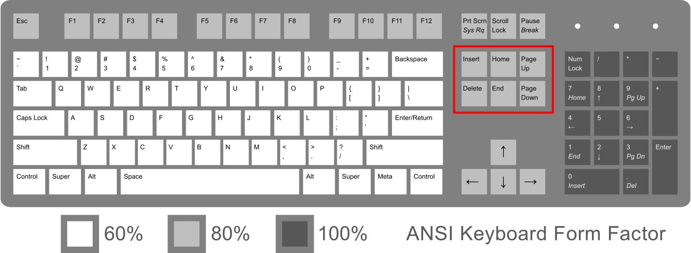

In the last 3 days (from <time datetime="2025-07-30">30/07/2025</time> to <time datetime="2025-08-01">01/08/2025</time>), there was an IT Fair in my university, where IT stores and brands came to sell goods with a discount or some freebies.

")

The thing is, I was looking for a new laptop for work so that I can code anywhere and anytime. Also, I don't want to interrupt my brother's sleep time too (#LateKnightCoder lmao). However, nothing stood out to me. I want something that can last for a long time at an affordable price, but I might be expecting way too much.

## Tons of Gadgets

But at the fair, there were tons of mechanical keyboards from Royal Kludge, Aula, Fantech, etc. For a while now, I've been showing some interest in mechanical keyboards. The old one that I was using, Neolution E-Sport Mirage, was just a cheap, rubber dome keyboard, and it's showing some age; the key starts to not perform very well, along with me noticing some issues with the rubber dome switch overall, like not being able to press multiple keys at the same time.

I tried many of them, but the Loga one from its own booth caught my attention. Loga is a Thai brand that focuses on making computer gadgets like mice and keyboards. I tried their keyboards and I love them, especially ones with a tactile switch like ChaThai. I prefer a tactile one to a linear one because I found the linear switch to be too "tamed" and isn't as fun to type on as the tactile one.

It took me a couple of days until the last day of the fair to actually buy it. The keyboard that I bought was a "DIY" set, containing a 104-key wireless keyboard base, switches, and keycaps priced at 3,290 THB (~100 USD) instead of 4,000+ THB or so. Despite the set being called "DIY," the staff there built it for me.

Many mechanical keyboards I found at the fair don't have the 100% (104 keys) layout, which I don't find as intuitive as the 100% keyboard. This is because I'm already accustomed to this little section right here, and it allows me to select text or move cursors much faster without lifting my hand for a mouse.

Although I'm *kind of* okay with no numpads since I also want to practice typing numbers without using it too, it's still great to have one, as I'm used to it as well.

While at it, I also tried an MXB1 wireless gaming mouse from Saru too, and I found it pretty lightweight—more than the one that I had before—so I bought that too for 1,590 THB (~48 USD). This means that I spent almost 5,000 THB on the gadgets.

## Giving Them a Test

Once I arrived home and tried the keyboard, I could tell that it felt much more amazing than my old keyboard. Each keypress feels more solid, and guess what? It goes *thocc*. The mouse also feels great, although it might have taken me some time to get used to it since I can't use the same old configuration for this new mouse.

Currently, I'm using both to write this new blog, and they're still indeed amazing.