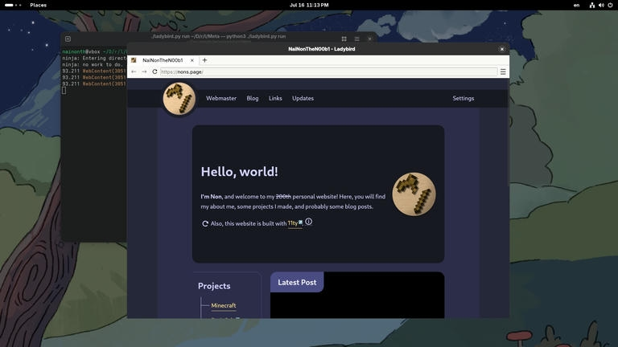
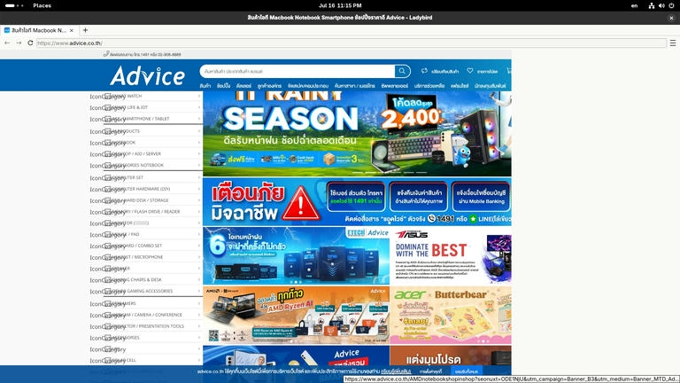
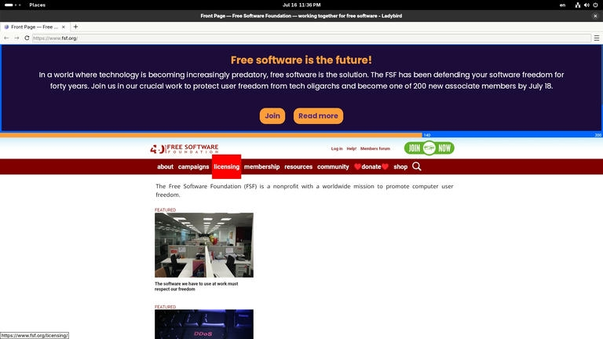
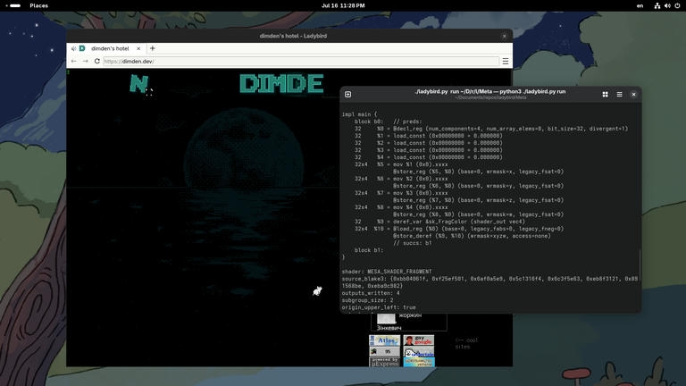
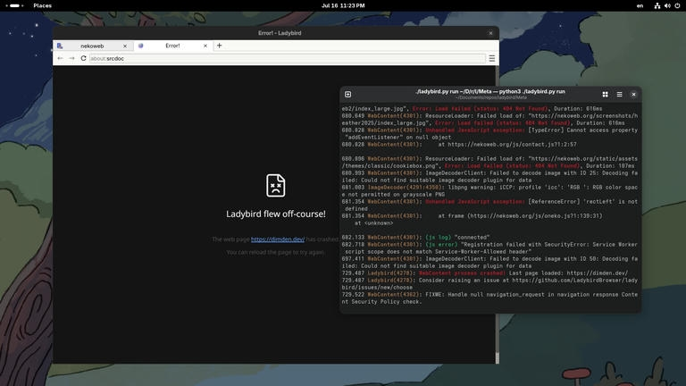

I've been very optimistic about the development of the Ladybird Web Browser, and I've been following their development on [their YouTube channel](https://www.youtube.com/@LadybirdBrowser) for a couple of months now. There were some issues going on while setting things up, but I still managed to be able to tried it out.

## Why Ladybird?

To briefly explain why the Ladybird exists, Ladybird Web Browser was initially created by Andreas Kling as an HTML viewer for Senerity OS for some time, until developers thought that it could potentially become a real web browser. So they decided to separate the development of Ladybird Web Browser from Serenity OS with the goal of making an independent web browser.

What do you mean by "independent," you asked? Google has been very influential in the web browsers market nowadays, whether developing Chromium—the web browser that many web browsers, like Microsoft Edge, Opera, etc, are relying on, or funding web browsers to keep their search engine as the default. What is really concerning is that with the power that Google has, it can dictate the way of how the web is going to be, whether it's good or bad. One example is the fact that [Google had removed the JPEG XL image format](https://news.ycombinator.com/item?id=36213330) that is easier for photographers to upload their optimized images on a website without any conversion from their web browser, raising much criticism. That's where the Ladybird comes in since it isn't dependent on the support from Google.

## First Try (failed)

Since currently (as of August 2025), Ladybird is only available for [UNIX-like](https://en.wikipedia.org/wiki/Unix-like) systems, I apparently cannot run Ladybird on Windows. Also, Ladybird is still in development, so there are no binaries are available for now. This means that in order to try it out, you need to compile it from source. Luckily, though, Ladybird developers had made it pretty easy to do so. All you need to do is install some dependencies and then run the script provided in the source code.

At first, I tried installing Ladybird through <abbr title="Windows Subsystem for Linux">WSL</abbr>. However, it didn't work out for me. This, along with the fact that it feels kind of weird to install a GUI program in WSL and it took really long to compile the source code, I kind of gave up trying to install it on WSL.

## Second Try (success, this time)

A couple of months later, I tried again. This time, instead of using WSL, I installed it on a virtual machine called [VirtualBox](https://www.virtualbox.org/) instead. Since I'm a simple guy, I just used [Fedora](https://fedoraproject.org/) on my <abbr title="Virtual Machine">VM</abbr>. It still took me some time, but it was a success, and the Ladybird Web Browser was actually running.

I started launching this website, [nons.page](/), first. Most stuff looked alright, except that the navigation button behaved a bit weird, there was no shadow—seems like it doesn't support multiple box shadow yet, and some elements looked a bit off their place.

I also tried out some other websites that I knew. The screenshot below is [Advice](https://www.advice.co.th) taken while Ladybird is loading it. Since it's a pretty heavy website, it took me a really long time for it to finish loading. And even if it did, it barely even scrolled (and eventually crashed).

This one was taken from [fsf.org](https://fsf.org). The layout here also looked off. The sidebar was under the main content instead of sitting beside it, and the navigation button hover effect overflowed.

Another one here was taken from [dimden.dev](https://dimden.dev), a website of Nekoweb's lead developer, dimden. This thing barely even loaded anything; besides the sidebar and the "Slow device" warning, the content didn't load at all.

Worse, after a while, Ladybird even crashed.

Generally, the common issue that I noticed on every website was the performance. It was awful, especially on heavy websites. Although VirtualBox is known to be laggy, the [LibreWolf web browser](https://librewolf.net) that was also installed on the VM did noticeably much better. In certain cases, if the website was really complex, Ladybird even crashed.

## Weeks Later

After weeks later, after the release of the Ladybird July 2025 browser update, I tried a newer version of Ladybird. The issues that I've mentioned above still persist. With that said, though, I still know for the fact that it's still in development. It's not even in an alpha stage yet until 2026 (the next year). It's nice to see many sponsors funding this project to solve the big issue that is going on with web browsers today.