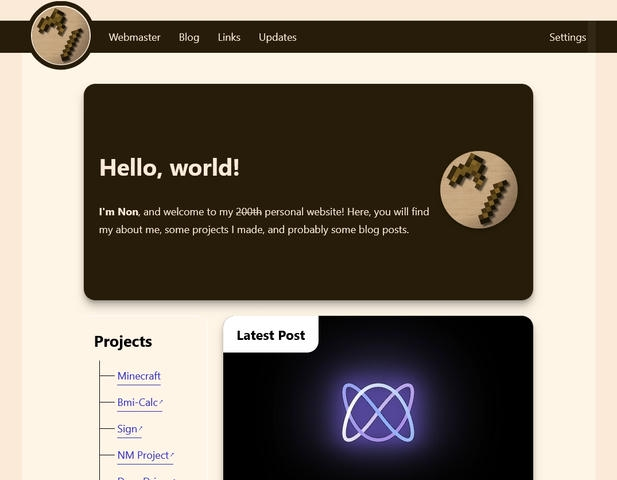
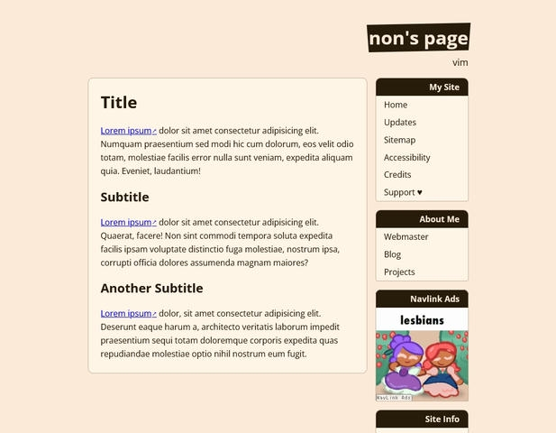
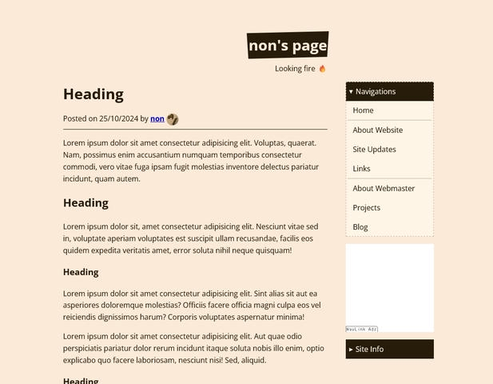
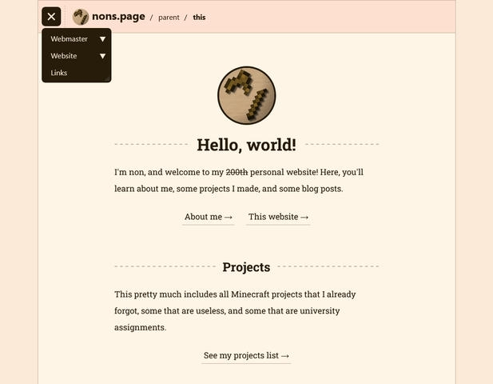
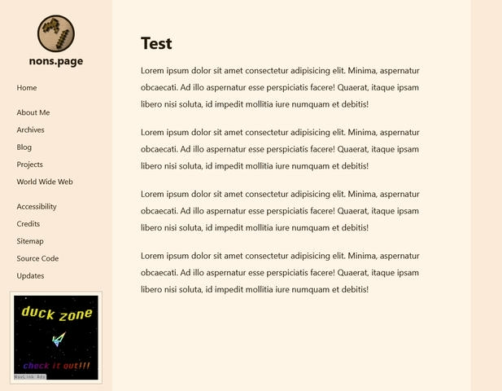
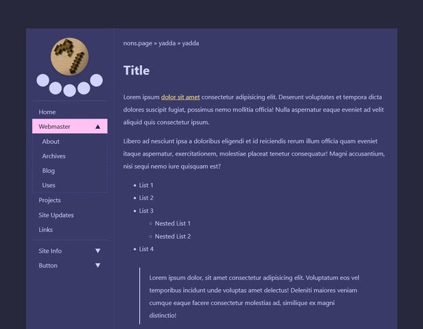
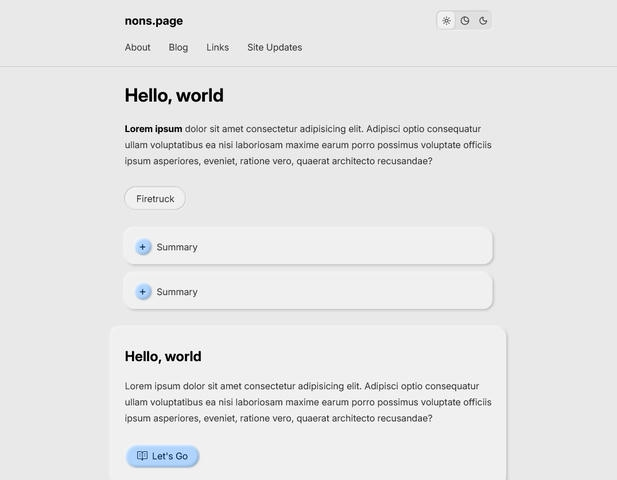
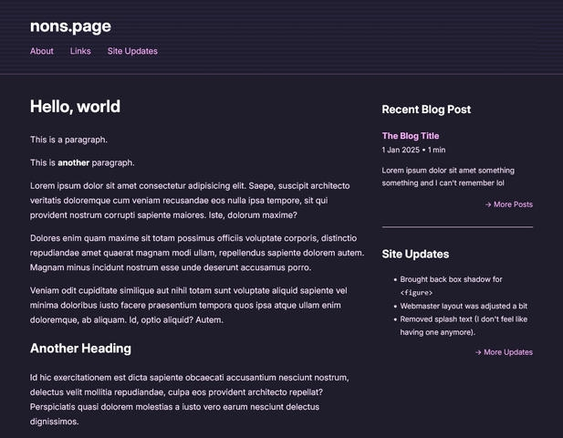
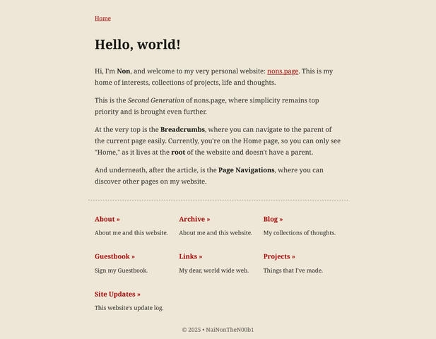

Happy 2026, and welcome to my new website! This new website here not only looks different, because it's also generated using [Lume](https://lume.land), my new go-to static site generator, replacing [11ty](https://11ty.dev).

## Why Change The Layout?

As time passes, I start to think that my old website layout looks messy and inconsistent. Some pages have grid-y sections here and there, and some have a regular article layout. Moreover, those inconsistencies bulk up the styling code, which goes against the website's philosophy of trying to be simple and minimal.

## Why Lume?

To put it simply, **Lume** has more official tools and plugins for me to work with than 11ty, resulting in easier development and tidier code. Whenever I look into my 11ty's configuration file, I can smell dignity in my code (eww).

Also, I spoke with [remblanc](https://remblanc.com/) in Nekoweb's Discord Server, and she said that 11ty's documentation is very hard to go through. And as time passes, the more I agree with them. The documentation is really confusing to find complex solutions like implementing a draft page or making pagination, and those solutions aren't really easy to implement. You really can't rely on the documentation alone, and you need to find another source.

Those, alongside some weird versioning with plugins that happened once with the 11ty's feed plugin, made me feel like I need to make a move.

## Design Evolution

Coming up with a website design that I like is definitely not easy since I've been doing this since 2024, around this post: [Two Projects in a Month and What's Next](/blog/two-projects-in-a-month).

Let's start with the first one. It's inspired by my old Neocities website, where there are multiple sections to the side of the main content. Notice the **nons.page** title on the top with some quirky background? That background is supposed to be animated like highlighting text from right to left.

And then, in this layout, I improved the last one a bit. The main section has no background, and sections in the sidebar are supposed to be collapsible.

Now, I tried several other layout designs. Here's the first one that looks similar to this new website, but with a menu button on the top, buttons are centered, and headings have a dashed line in the middle next to them.

And this one has a sidebar in it for page navigation and a NavBar ad.

This one took the previous layout and made it look a little more interesting.

And then, I tried out the Neumorphism design, which is the design that sits in between the Skeumorphism design that tries to resemble real-life objects and the flat design. But I added a little background color so that the contrast wouldn't be as bad. There's no sidebar anymore, as it's replaced with a good ol' header with the logo and page navigation. However, it's really heavy, pretty hard to manage, and only works well with specific colors.

And this is another one where I brought back the sidebar and used it with the header from the previous layout. The sidebar was used to serve additional content next to the main one. I also tried to pick colors that made the website look like how cities would look at night.

That is, until the end of 2025, when I still couldn't find the one that I like. I then decided to go for a more classic-looking website, where every page used the same layout and styling for each component, like navigation, lists, etc. And this is the time when I really had to make a decision. This time, I decided to move the page navigation from the header to the bottom after the article, leaving the top with only the breadcrumbs. At first, I wanted the page navigation to only be available on the home page, but then I decided to just put it on every page.

Although I'm quite aware that people wouldn't find the other pages, since I still have the breadcrumbs on the top, and the home page isn't very long, I think it's kind of okay.

When I posted the first demo of the layout, everyone who saw it seemed to like it. So I moved forward into implementing it with **Lume**. I changed things a bit and added more styling for some other components I needed. And voila!

The new layout and the basic features of this new website are done before 2026. This layout, including styling for all components, only takes one file of CSS with around 2KB minified instead of almost 6KB from my old CSS file for the main part alone—not including other CSS files for different pages.

With that said, however, I still have to load the **Noto Serif** font, which takes up like 85KB (🤦). But anyway, the site looks clean and minimal, and everything looks consistent.

This website also still doesn't have certain features implemented, like user-accessible taxonomy, dark mode, or modified date. Also, I still haven't implemented pagination in the Blog Index, even though it would only show 1/1 anyway (lol). It shouldn't be hard. Maybe I'll implement them later, but not now.