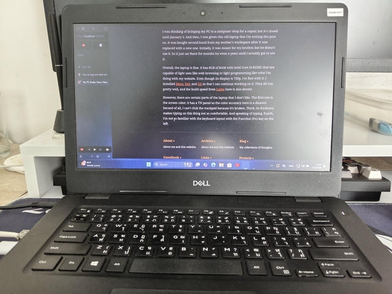

Around 2024, I wrote the blog post about [my PC freezing because of dried out thermal paste](/blog/my-pc-froze-and-couldn-t-turn-back-on). But then, in the new year of 2026, after I posted this, [Happy New Website](/blog/happy-new-website), for a couple of hours, it froze upon me again while I was playing GTA V. This time, however, when I tried restarting my PC, it bootlooped, even after many hours later.

I'm not sure if it was because either the CPU or GPU just gave up on its life, or it was just my motherboard going insane. There was a sign of the issue where previously, when I played GTA IV or even GTA V before the freeze, the game suddenly just crashed.

I was thinking of bringing my PC to a computer shop for a repair, but it's closed until January 5. And then, I was given this old laptop that I'm writing this post on. The laptop is Dell Latitude 3490 released in 2018, and it was bought second-hand from my mother's workspace after it was replaced with a new one. Initially, it was meant for my brother, but he doesn't use it. So it just sat there for months (or even a year) until I actually got to use it.

Overall, the laptop is fine. It has 8GB of RAM with Intel Core i5-8250U that are capable of light uses like web browsing or light programming like what I'm doing with my website. Plus, there's an Ethernet port, so I still can use the internet reliably like my PC. Even though its display is 720p, I'm fine with it. I installed [Deno](https://deno.com), [Zed](https://zed.dev), and [Git](https://git-scm.com) so that I can continue working on it. They all run pretty well, and the build speed from [Lume](https://lume.land) here is also decent.

However, there are certain parts of the laptop that I don't like. The first one is the screen color; it has a TN panel so the color accuracy here is a disaster. Second of all, I can't click the trackpad because it's broken. Third, its thickness makes typing on this thing not so comfortable. And speaking of typing, fourth, I'm not so familiar with the keyboard layout with the Function (Fn) key on the left, which moves the position of the Alt key that I frequently use, and I always accidentally press the Windows key instead of the Alt key.

Despite the good thing it has, I never think of it to be my own personal computer. It's not even mine, so I don't feel like installing much software on it. I'm still looking forward to sending my PC to a computer shop in this incoming week.
