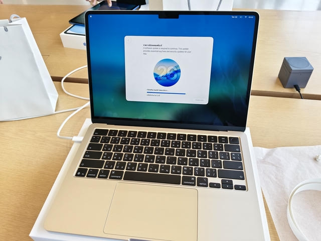

I've already mentioned about getting a new laptop since [the post that I talked about getting a new mechanical keyboard](/blog/my-first-mechanical-keyboard). I didn't buy one last time since I didn't know what to get. Currently though, since my co-operative education (kinda like normal internship but fancier) is almost started, I need to get a laptop before that time.

## Making Decision

There are multiple criterias that I require my laptop to have. But basically, I want something that is equivalent or better than the one that my workplace provides to its full-time developers: a MacBook Air M3 (16GB RAM, 256GB storage), which I don't get one, since I'm just its intern.

Let's start with the display. My laptop should score at least 100% in sRGB (also 100% in P3, ideally to match with workplace's MacBook) to ensure color accuracy when I do the design work. My mother's old laptop: Dell Latitude 3490 has a horrible-looking, low-res TN panel so that's why I need a new one. I still keep it for trying out Linux and potentially some light work. Cheap laptops usually have NTSC scored at around 45%, which means that it doesn't satisfy the 100% sRGB requirement.

CPU power and RAM capacity is also something I consider. Even though my Intel Core i5-8400 and i5-8250U still does my work just fine, I just don't know how much I need for my workplace. For RAM, 16GB is the mininum. More is good, but I don't think I need it for now.

Longevity is one of the most important concern to consider. I want my laptop to last for at least around 4-5 years. This is the biggest reason why I don't really trust any cheap laptops since I don't know how many gotchas they have, like having a cheap hinge that will break in a few years for example.

With all of that said, the first option to cut off is budget laptop line of products like Ideapad, Vivobook, and similar since I don't trust its build quality and cheaper options of them can have a pretty bad screen. That left me with premium consumer laptops which has better build quality overall. Some even has a high-res OLED screen, though they can get very pricey, some tiems even pricier than a MacBook Air.

Oh, did I just mentioned a MacBook Air? Yeah, that's what I ended up getting with 16GB of RAM and 512GB of storage. It features a high-quality screen, though it might have a lower resolution and lower frequency than some premium Windows laptop, it's still sharp enough for small text and the 60Hz doesn't look that bad in real world use (though I think Apple should bump up the frequency of the Air to... maybe 90Hz). Its Apple Silicon M5 though is a beast; not only it's very efficient, it's also very fast and blows Intel or AMD CPUs on laptops at a closer price range out of the water. And even some Windows laptop offer 32GB of RAM, I think 16 should be good on MacOS, since it's known to be more efficient than Windows, thanks to memory compression – not 32GB equivalent, but should be able to give a bit more headroom. Also, I get to escape from Windows. I mean, it's still going downhill to the point that I don't know what will happen to Windows.

## First Time At Apple Store

I decided to buy my first MacBook at the [ICONSIAM Apple Store](https://www.apple.com/th/retail/iconsiam/), since I can get a discount as a student, down from 36900 THB to 33490 THB when I buy one from the official Apple Store, which is lower than student discount I found at authorised resellers, down to only 35200 THB. Retailers in Thailand usually don't discount laptops, and even if there is, they're either an older model or they don't come down as much.

At the time when I arrived there, there were a lot of people since it's the first of the month (May 1st) and it's a day off for many workers because it's the Nation Labor's day. I took some time to look around before approaching one staff. I asked to buy a MacBook Air 13" Starlight with an education price. They asked me for my student ID card, my name, and my E-mail used in my Apple ID account. I already have one for my iPad so it was pretty easy. Then I paid up for 33500 THB and got a 10 THB change. Since this is my first MacBook, the staff led me to get things setup first in the store, just in case if I needed any help (and I did). I did have some small talk with some employees about MacBooks and things.

Before leaving the store, I asked the Apple employee to get me a bag and help me with getting my MacBook back into the box with a wrap. After I put the box into the Apple bag, they weren't there already (probably busy since there were indeed a lot of people).

## Faulty Model

While setting up and waiting for the MacOS to update, I think I noticed some marks on that model. I alerted an Apple employee and they changed it for a new one. I asked them where the faulty model will go and they said that it will be checked and its body will be recycled, following the returning procedure. I then got a second one without any marks. The setup went well and everything was good.

## First MacBook Experience

I'm currently writing this blog post on my Macbook Air. I'm very impressed by the look of it. The starlight color really does shine in contrast to the black keyboard. The haptic trackpad also feels amazing to use. It's smooth and very satisfying to click on. It's keyboard is great, though I've heard that some reviewed commented that it's quite low-travel, but I'm good with it. The screen is good enough for coding. I also get to try the MacOS and [Homebrew](https://brew.sh), a package manager built for MacOS.

## Acknowledging Apple Taxes

Despite good things my MacBook has, it's still important for me to know that I can't upgrade my MacBook after buying it. Also, without Apple Care+, replacing a battery can set me back around 6000-8000 THB, but that's about the future, and I'm still happy with my purchase.